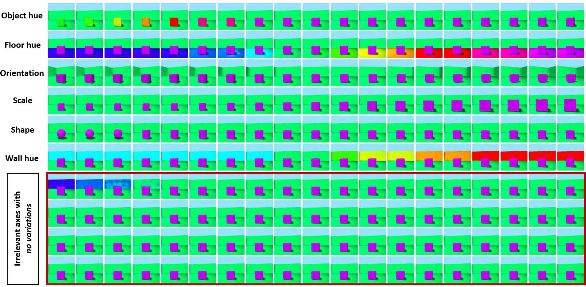
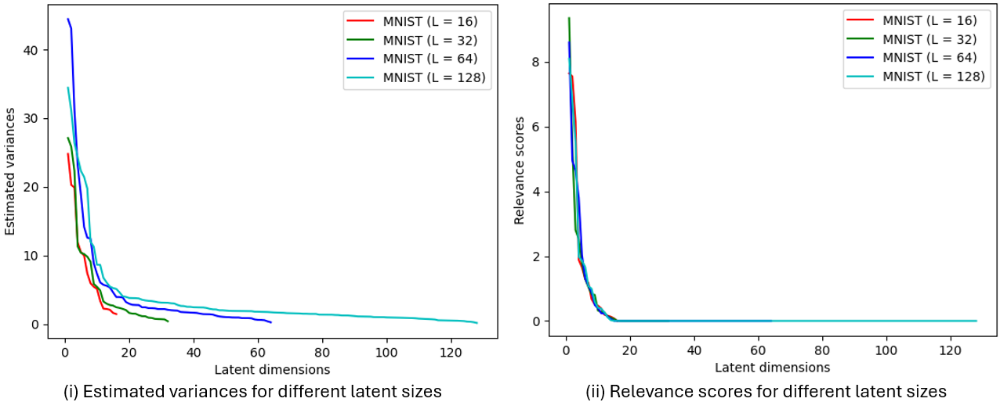
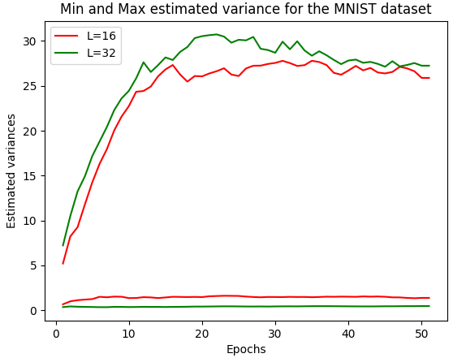
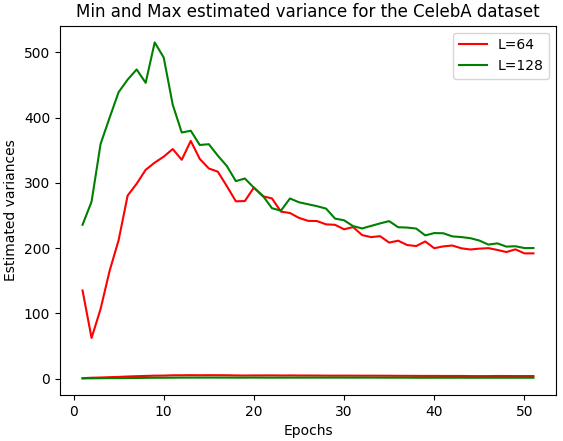
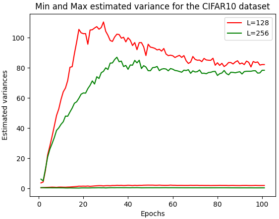

# ARD-VAE: Finding the Relevant Latent Dimensions of Variational Autoencoders

<p align="center">
  
</p>

Official implementation of **"ARD-VAE: A Statistical Formulation to Find the Relevant Latent
Dimensions of Variational Autoencoders"** by **Surojit Saha, Sarang Joshi, and Ross Whitaker**
(University of Utah), **WACV 2025**.

The **Automatic Relevancy Detection VAE (ARD-VAE)** discovers *how many* latent dimensions a
dataset actually needs — instead of treating the bottleneck size as a hyperparameter tuned by
trial and error. It replaces the VAE's fixed prior $`\mathcal{N}(\mathbf{0}, \mathbf{I})`$ with a
**hierarchical (relevance-aware) prior** whose per-axis variance is *learned from the encoded
data*. Irrelevant axes are driven to near-zero variance, so the relevant dimensions can be read
off after training. Crucially, this **does not modify the ELBO** (only the prior) and adds
**no extra regularizer or hyperparameter** beyond the single reconstruction/KL trade-off weight.

Code: https://github.com/Surojit-Utah/ARD-VAE

Paper (arXiv): https://arxiv.org/abs/2501.10901

<p align="center">
  
</p>

<p align="center"><em>On 3D Shapes, traversing a <strong>relevant</strong> latent axis changes a single
generative factor, while traversing a <strong>collapsed</strong> (pruned) axis leaves the decoder
output essentially unchanged — exactly the behavior ARD-VAE uses to identify the relevant axes.</em></p>

---

## Table of Contents
- [Key Contributions](#key-contributions)
- [Method](#method)
  - [Background: the VAE ELBO](#background-the-vae-elbo)
  - [Relevance-aware hierarchical prior](#relevance-aware-hierarchical-prior)
  - [Estimating the hyperprior from data](#estimating-the-hyperprior-from-data)
  - [The ARD-VAE objective](#the-ard-vae-objective)
  - [Determining the relevant axes](#determining-the-relevant-axes)
  - [Training algorithm](#training-algorithm)
- [Repository Structure](#repository-structure)
- [Installation](#installation)
- [Datasets](#datasets)
- [Usage](#usage)
- [Extending ARD-VAE to a new dataset](#extending-ard-vae-to-a-new-dataset)
- [Results](#results)
- [Key Findings](#key-findings)
- [Citation](#citation)

---

## Key Contributions

1. **Relevance discovery via a hierarchical prior.** ARD-VAE finds the relevant latent axes
   using an automatic-relevance-determination (ARD) prior, **without modifying the VAE ELBO**.
2. **Architecture- and optimizer-agnostic.** Unlike mask/gating methods (MaskAAE,
   GECO-$`L_0`$-ARM-VAE), it needs no trainable masks, no $`L_0`$ regularizer, and no special
   training recipe — just the standard reconstruction/KL trade-off weight.
3. **Start-high, prune-down.** Begin with a generously large latent size and let training
   collapse the unnecessary axes; the discovered count is robust to the initial size.
4. **Validated broadly.** Matches the known factor count on synthetic data (DSprites, 3D Shapes)
   and gives the best/near-best FID, precision-recall, and disentanglement (MIG) on real data.

---

## Method

### Background: the VAE ELBO

A VAE maximizes the evidence lower bound (ELBO) with an amortized Gaussian posterior
$`q_\phi(\mathbf{z}\mid\mathbf{x}) = \mathcal{N}(\boldsymbol\mu_{\mathbf{x}}, \boldsymbol\sigma_{\mathbf{x}}^2 \mathbf{I})`$
and a fixed prior $`p(\mathbf{z}) = \mathcal{N}(\mathbf{0}, \mathbf{I})`$:

```math
\max_{\theta,\phi}\ \mathbb{E}_{p(\mathbf{x})}\Big[ \mathbb{E}_{q_\phi(\mathbf{z}\mid\mathbf{x})}\log p_\theta(\mathbf{x}\mid\mathbf{z}) - \mathrm{KL}\big(q_\phi(\mathbf{z}\mid\mathbf{x})\,\|\,p(\mathbf{z})\big) \Big].
```

A fixed isotropic prior forces every axis to unit variance, so the bottleneck size $`L`$ must be
chosen by hand and mismatches with the intrinsic dimension hurt the model.

### Relevance-aware hierarchical prior

ARD-VAE lets each axis carry its own precision $`\alpha_l`$, with variance $`\alpha_l^{-1}`$, drawn from a
Gamma **hyperprior** — the classic ARD construction:

```math
p(\mathbf{z}\mid\boldsymbol\alpha) = \prod_{l=1}^{L} \mathcal{N}\big(z_l;\, 0,\ \alpha_l^{-1}\big), \qquad p(\boldsymbol\alpha) = \prod_{l=1}^{L} \mathrm{Gamma}\big(\alpha_l;\, a_l^0,\ b_l^0\big).
```

Marginalizing $`\boldsymbol\alpha`$ yields a **Student's t** prior per axis. With uninformative
$`a_l^0 = b_l^0 = 0`$, this concentrates mass near zero since $`p(z_l) \propto 1/|z_l|`$, which
**induces sparsity** — the mechanism that prunes unused axes.

### Estimating the hyperprior from data

Because the Gamma is conjugate to the Gaussian, the posterior $`p(\boldsymbol\alpha\mid D_{\mathbf{z}})`$
over precisions — given a set of latent codes $`D_{\mathbf{z}}`$ produced by the encoder — is again
Gamma, with closed-form per-axis parameters:

```math
a_l = a_l^0 + \frac{n}{2}, \qquad b_l = b_l^0 + \frac{1}{2}\sum_{i=1}^{n}\big(z_l^i - \mu_l\big)^2,
```

where $`n = |D_{\mathbf{z}}|`$. In practice $`a_l^0 = b_l^0 = 0`$ and $`\mu_l = 0`$, so $`a_l`$ is fixed
by the sample count and only $`b_l`$ is refreshed from the latest codes.

### The ARD-VAE objective

The marginalized, data-dependent prior $`p(\mathbf{z}\mid D_{\mathbf{z}})`$ replaces the fixed prior
in the ELBO — **nothing else changes**:

```math
\max_{\theta,\phi}\ \mathbb{E}_{p(\mathbf{x})}\Big[ \mathbb{E}_{q_\phi(\mathbf{z}\mid\mathbf{x})}\log p_\theta(\mathbf{x}\mid\mathbf{z}) - \mathrm{KL}\big(q_\phi(\mathbf{z}\mid\mathbf{x})\,\|\,p(\mathbf{z}\mid D_{\mathbf{z}})\big) \Big].
```

With enough samples in $`D_{\mathbf{z}}`$ (high degrees of freedom), the Student's t is well
approximated by a Gaussian with per-axis variance $`\hat\sigma_l^2 = b_l/a_l`$, giving a
**closed-form KL**:

```math
\mathrm{KL} = -\frac{L}{2} - \frac{1}{2}\sum_{i=1}^{L}\log\sigma_i^2 + \frac{1}{2}\sum_{i=1}^{L}\log\hat\sigma_i^2 + \frac{1}{2}\sum_{i=1}^{L}\frac{\mu_i^2 + \sigma_i^2}{\hat\sigma_i^2}, \qquad \hat\sigma_i^2 = b_i/a_i.
```

Here $`\boldsymbol\mu, \boldsymbol\sigma^2`$ come from the encoder, and
$`\hat{\boldsymbol\sigma}^2 = \mathbf{b}_L/\mathbf{a}_L`$ is the learned per-axis target variance.
This is implemented in [`loss/vae_loss.py`](loss/vae_loss.py) as `kld_loss(mean, log_var, alpha, beta)`.

### Determining the relevant axes

After training, ARD-VAE ranks axes rather than using a hard mask. The **estimated variance** is
$`\hat{\boldsymbol\sigma}^2 = \mathbf{b}_L/\mathbf{a}_L`$; collapsed axes have low but non-zero
variance, so a raw threshold is unreliable. Instead, a decoder-sensitivity weight (mean squared
Jacobian of the output w.r.t. the latent mean) sharpens the estimate:

```math
\mathbf{w}_{\hat\sigma} = \frac{1}{N}\sum_{i=1}^{N}\big\lVert \mathbb{J}_i \big\rVert^2, \qquad \mathbb{J} = \Big[\frac{\partial \hat{\mathbf{x}}}{\partial \mu_1} \cdots \frac{\partial \hat{\mathbf{x}}}{\partial \mu_L}\Big] \in \mathbb{R}^{D\times L},
```

and the **relevance score** is the weighted variance
$`\hat{\boldsymbol\sigma}^2_{\mathbf{w}} = \mathbf{w}_{\hat\sigma} \odot \hat{\boldsymbol\sigma}^2`$.
The **active** dimensions are the smallest set explaining ~99% of the score. This same importance
measure also works to count active axes of a plain VAE and its variants.

**Why the relevance score matters.** The raw estimated variance alone is noisy and its scale
varies with the initial latent size, making a single threshold unreliable. Weighting by the
decoder-sensitivity Jacobian squashes spurious axes and yields a clean, size-agnostic profile
(right) from which the active count is read off:

<p align="center">
  
</p>

The same estimated-variance profile holds across real datasets — a few high-variance relevant
axes and many collapsed ones:

<p align="center">
  
  
  
</p>
<p align="center"><em>Estimated variance <code>b/a</code> per latent axis (sorted) for MNIST, CelebA,
and CIFAR10 — relevant axes carry high variance; the rest collapse toward zero.</em></p>

### Training algorithm

1. Split $`\mathcal{X}_{train}`$ into an SGD set $`\mathcal{X}_{sgd}`$ and a (smaller) hyperprior set
   $`\mathcal{X}_{\alpha}`$ with $`|\mathcal{X}_{\alpha}| \approx 10\mathrm{K}`$.
2. Each epoch, encode $`\mathcal{X}_{\alpha}`$ to form $`D_{\mathbf{z}}`$ and update
   $`\mathbf{a}_L, \mathbf{b}_L`$ via the closed forms above (a **lagged** update stabilizes the KL
   target); then resample $`\mathcal{X}_{\alpha}`$ and $`\mathcal{X}_{sgd}`$.
3. For each minibatch from $`\mathcal{X}_{sgd}`$: encode, reconstruct, and minimize
   `reconstruction + kld_scalar * KL(q || p(z|D_z))` with Adam.
4. The single hyperparameter `kld_scalar` — the paper's $`\beta`$ — is tuned to reach a target
   validation reconstruction; it is **insensitive to the initial latent size** $`L`$.

---

## Repository Structure

```
ARD-VAE/
├── Main.py                    # Entry point: --run_id, --config_id
├── config/local_config.py     # Per-dataset configurations (0=CIFAR10, 1=CelebA, 2=MNIST)
├── data/                      # Dataloaders: MNIST, CIFAR10, CelebA (+ datagenerator)
├── models/                    # Encoder/Decoder + Sampling per dataset (ae_model_*)
├── loss/vae_loss.py           # ARD KL (Gamma target var b/a) + reconstruction (MSE / BCE)
├── train/trainer.py           # Training loop + per-epoch hyperprior (a, b) updates
├── lr_schedular/              # ReduceLROnPlateau (CustomReduceLRoP)
├── eval/study_fid/            # FID (Inception), precision/recall, relevant-axis analysis
├── util/                      # Plotting, logging, directory helpers
└── README.md
```

---

## Installation

ARD-VAE is implemented in **TensorFlow / Keras** (no PyTorch). A typical environment:

```bash
conda create -n ardvae python=3.9
conda activate ardvae
pip install -r requirements.txt
# or explicitly:
# pip install tensorflow numpy scipy matplotlib imageio tqdm nvidia-ml-py3
```

> `Main.py` uses `nvidia_smi` (from `nvidia-ml-py3`) to auto-select a free GPU and falls back to
> CPU when none is available. FID evaluation loads a frozen Inception-v3 graph via
> `tensorflow.compat.v1`.

---

## Datasets

Real-world benchmarks (initial latent size $`L`$ from the WAE/RAE literature):

| Dataset | Input | Paper $`L`$ | Notes |
|---|---|---:|---|
| **MNIST**   | $`32\times32\times1`$ | 16  | auto-downloads via Keras; padded 28→32 |
| **CelebA**  | $`64\times64\times3`$ | 64  | needs a pre-built `train_images_npy.npy` |
| **CIFAR10** | $`32\times32\times3`$ | 128 | auto-downloads via Keras |
| **ImageNet** (32×32) | $`32\times32\times3`$ | 256 | (supplementary) |

Synthetic disentanglement benchmarks with **6 known factors** (ground-truth active count),
trained with an initial $`L=10`$:

| Dataset | Known factors |
|---|---:|
| **DSprites** | 6 |
| **3D Shapes** | 6 |

Pixels are scaled to $`[0,1]`$ for MNIST/CIFAR10; CelebA is mapped to $`[-1,1]`$.

> **What's included in this repo.** This snapshot ships dataloaders (`data/`), models (`models/`),
> and `Main.py` dispatch branches for **MNIST, CelebA, and CIFAR10**. The paper's full evaluation
> also covers **DSprites, 3D Shapes, and ImageNet**, and the training/eval code already includes
> the hooks for them (e.g. `trainer.py` and the sample generator use a **Bernoulli/logits decoder**
> for `DSprites`). Their **dataloaders/models** simply aren't part of this snapshot — add them by
> following [Extending ARD-VAE to a new dataset](#extending-ard-vae-to-a-new-dataset). The
> disentanglement metrics (FactorVAE/MIG) follow the standard `disentanglement_lib` setup.

> **CelebA data.** `data/dataloader_CelebA.py` loads `train_images_npy.npy` from the **current
> working directory** (`data_dir = ''`). Build that NumPy array of CelebA images
> (`64×64×3`, uint8/float) beforehand and run `Main.py` from the directory that contains it, or
> edit `self.data_dir`.

> **Note — shipped config vs. paper.** `config/local_config.py` ships **start-high** initial
> sizes: CIFAR10 `latent_dim=256`, CelebA `latent_dim=64`, MNIST `latent_dim=128` (with
> `kld_scalar` 0.05 / 3.0 / 0.5). The paper's main FID/precision-recall table uses **MNIST L=16**
> and **CIFAR10 L=128**. Set `latent_dim` accordingly to reproduce a specific table; the whole
> point of ARD-VAE is that the discovered active count is stable across the initial $`L`$.

---

## Usage

**1) Configure** the run in `config/local_config.py` (`dataset_name`, `latent_dim`, `num_filter`,
`epochs`, `batch_size`, `t_stat_samples`, `learning_rate`, `kld_scalar`, etc.).

**2) Train** by selecting a config index and a run id (the run id sets the seed):

```bash
python Main.py --run_id 1 --config_id 0
```

`--config_id` selects a dataset config: `0 = CIFAR10`, `1 = CelebA`, `2 = MNIST`. Each
`--run_id` is a different seed (the paper trains **5 runs** per dataset). Outputs are written to
`logs/{dataset}/Dim_{L}/Run_{run_id}/` (checkpoints, reconstructions, generations, latent
projections, TensorBoard logs).

**3) Evaluate** (FID + precision/recall + active dimensions) via the scripts in
[`eval/study_fid/`](eval/study_fid/) — generate samples from a checkpoint and score them against
the pre-computed Inception statistics (`fid_stats_*.npz`).

---

## Extending ARD-VAE to a new dataset

A new dataset requires **four wired pieces** — mirror an existing one (e.g. CIFAR10):

1. **Config** — add an entry in `config/local_config.py` (`dataset_name`, `latent_dim`,
   `num_filter`, `epochs`, `kld_scalar`, `t_stat_samples`, …).
2. **Dataloader** — add `data/dataloader_<NAME>.py` implementing the trainer contract:
   - `__init__(dataset_name, t_stat_samples, batch_size=100)`
   - `split_train_n_val_data() -> (x_train, x_val)`  (called once in `Main.py`)
   - `create_val_dataset() -> tf.data.Dataset`  (called in `Trainer.__init__`)
   - `create_t_stat_n_train_dataset() -> (train_dataset, t_stat_dataset)`  (called each epoch;
     draws a disjoint SGD / hyperprior split)
   - exposes attributes `batch_size`, `t_stat_samples`, `x_train`, `x_val`
   - images as `float32` NHWC normalized to `[0,1]` (or `[-1,1]` like CelebA).
3. **Model** — add `models/ae_model_<NAME>.py` with `Encoder(latent_dim, num_filter,
   conv_kernel_initializer_method, scatter_use_var, axis_samples)` returning
   `[mean, log_var]` (width `2*latent_dim`) and `Decoder(latent_dim, num_filter, input_channels,
   reg_strength, conv_kernel_initializer_method)`; both take `call(inputs, use_batch_norm, training)`.
4. **Dispatch** — add the import and an `elif dataset_name=='<NAME>':` branch in `Main.py`.

Use MSE reconstruction (`autoencoder_loss`) for continuous pixels or BCE (`autoencoder_ce_loss`)
for binary data (e.g. DSprites). No bandwidth/relevance hyperparameters need tuning — only
`kld_scalar`.

**Evaluation is a separate sub-pipeline.** `eval/study_fid/` is largely standalone: it has its
**own** `local_config.py` and **duplicated** `ae_model_*` copies, and expects pre-computed
reference statistics (`fid_stats_<dataset>.npz`). To score a new dataset (FID / precision-recall /
active dimensions) you must **also** register it there (config + model) and provide its FID
reference stats — training-side wiring alone is not enough.

---

## Results

All methods are trained **5 times** per dataset (mean ± std). **Active** = number of latent
dimensions actually used.

### Disentanglement — synthetic data with known factors (GT = 6), FactorVAE ↑ / MIG ↑

Competing methods use $`L=6`$ (the *known* factor count — an advantage unavailable in practice);
ARD-VAE starts from $`L=10`$ and discovers the count.

| Method | DSprites FactorVAE | MIG | Active | 3D Shapes FactorVAE | MIG | Active |
|---|---:|---:|---:|---:|---:|---:|
| VAE (L=6)          | 64.78 | 0.06 | 6.00 | 55.85 | 0.13 | 6.00 |
| $`\beta`$-TCVAE (L=6)| **75.55** | 0.20 | 6.00 | 75.51 | 0.40 | 6.00 |
| DIP-VAE-I (L=6)    | 59.47 | 0.05 | 6.00 | 51.94 | 0.06 | 6.00 |
| DIP-VAE-II (L=6)   | 60.70 | 0.08 | 6.00 | 63.66 | 0.24 | 6.00 |
| RAE (L=6)          | 64.21 | 0.04 | 6.00 | 53.57 | 0.03 | 6.00 |
| **ARD-VAE (L=10)** | 63.37 | **0.22** | **5.80** | **79.26** | **0.52** | **6.40** |

ARD-VAE recovers ≈6 active dimensions and gives the best MIG on both datasets and the best
FactorVAE metric on 3D Shapes.

### Generative quality — FID ↓, Precision ↑, Recall ↑

| Method | MNIST (L=16) Active | FID | Prec | Rec | CIFAR10 (L=128) Active | FID | Prec | Rec |
|---|---:|---:|---:|---:|---:|---:|---:|---:|
| VAE               | 16 | 28.78 | 0.88 | 0.97 | 128 | 147.74 | 0.50 | 0.47 |
| $`\beta`$-TCVAE     | 16 | 50.62 | 0.82 | 0.95 | 128 | 180.94 | 0.30 | 0.41 |
| RAE               | 16 | **18.79** | 0.87 | 0.95 | 128 | 94.34 | 0.74 | 0.47 |
| WAE               | 16 | 25.42 | **0.92** | 0.92 | 128 | 140.49 | 0.42 | 0.31 |
| GECO-$`L_0`$-ARM-VAE| 10.0 | 304.75 | 0.03 | 0.38 | 68.0 | 320.75 | 0.02 | 0.04 |
| MaskAAE           | 9.8 | 144.92 | 0.00 | 0.07 | 3.8 | 298.30 | 0.07 | 0.04 |
| **ARD-VAE**       | 12.8 | 22.24 | 0.91 | **0.98** | 105.8 | **87.56** | **0.82** | **0.51** |

ARD-VAE uses **fewer** dimensions than the nominal $`L`$ while achieving the best FID / precision /
recall on CIFAR10 and the best recall on MNIST — whereas the mask/gating baselines (MaskAAE,
GECO-$`L_0`$-ARM-VAE) fail badly on this shared architecture.

### `kld_scalar` (β) is insensitive to the initial latent size

Fixing $`\beta`$ and only changing the initial size to $`2L`$ or $`4L`$ barely moves the discovered
count or FID:

| Dataset | $`2L`$ Active | $`2L`$ FID | $`4L`$ Active | $`4L`$ FID |
|---|---:|---:|---:|---:|
| MNIST (L=16)   | 12.60 | 22.30 | 12.40 | 22.31 |
| CIFAR10 (L=128)| 116.40 | 86.50 | 117.80 | 87.88 |

---

## Key Findings

- **Discovers the right count.** On synthetic data with 6 known factors, ARD-VAE recovers ≈6
  active axes from an over-specified $`L`$; the count is stable for $`L \in \{10,15,20,30\}`$.
- **Best/near-best generation.** Best FID, precision, and recall on CIFAR10 and best recall on
  MNIST, using fewer than the nominal dimensions.
- **Robust where mask/gating methods break.** MaskAAE and GECO-$`L_0`$-ARM-VAE are highly sensitive
  to architecture/hyperparameters and collapse or diverge on the shared setups; ARD-VAE needs
  only the standard `kld_scalar`.
- **No ELBO surgery.** The only change from a vanilla VAE is the hierarchical (relevance-aware)
  prior — so ARD-VAE drops into virtually any VAE architecture.

---

## Citation

If you use this code or method, please cite:

```bibtex
@inproceedings{saha2025ardvae,
  title     = {ARD-VAE: A Statistical Formulation to Find the Relevant Latent Dimensions of Variational Autoencoders},
  author    = {Saha, Surojit and Joshi, Sarang and Whitaker, Ross},
  booktitle = {IEEE/CVF Winter Conference on Applications of Computer Vision (WACV)},
  year      = {2025},
  eprint    = {2501.10901},
  archivePrefix = {arXiv}
}
```

**Authors:** Surojit Saha, Sarang Joshi, Ross Whitaker — University of Utah
(`surojit.saha@utah.edu`, `sarang.joshi@utah.edu`, `whitaker@cs.utah.edu`).